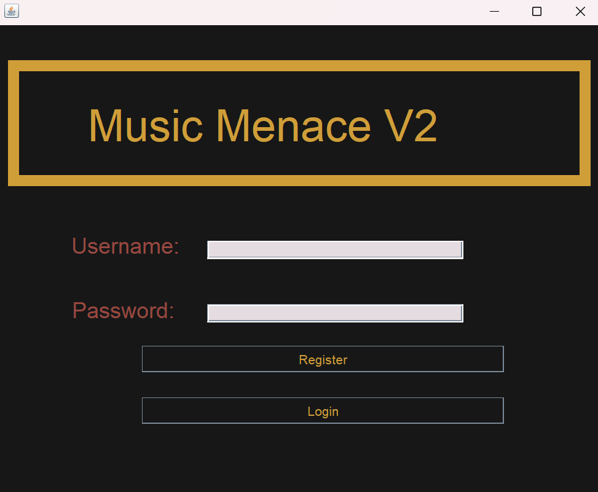
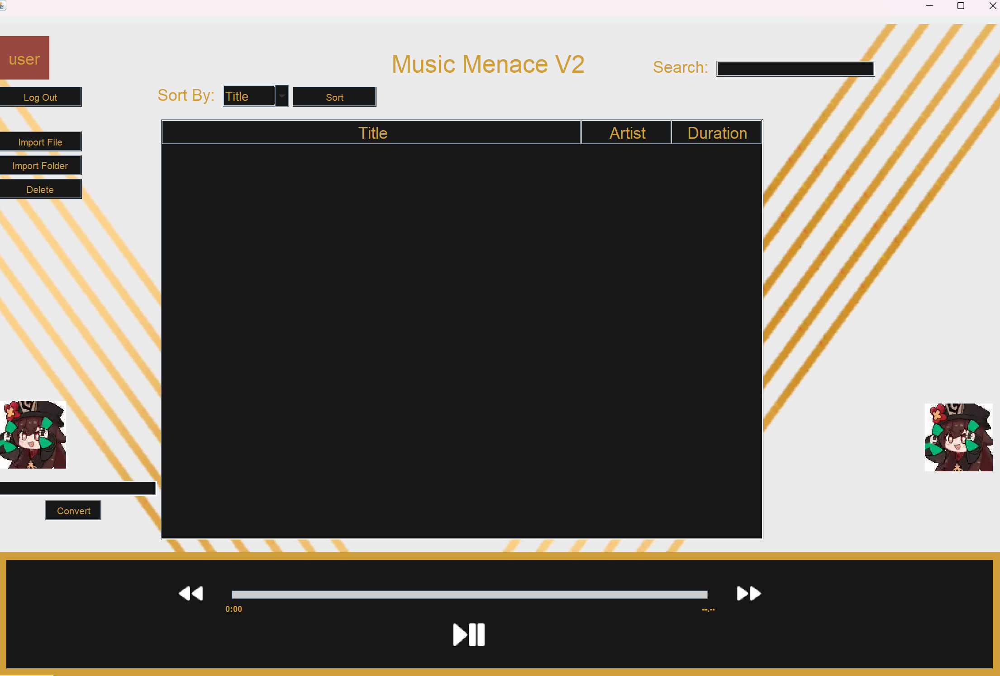

# 🎵 musicMenaceV2 - Music Player

Music application with a built-in login system, capable of importing local audio files and extracting audio from YouTube videos.

---

## 🛠️ How to Use This Application

### 1. 🎹 Download the Dependencies

- **Java version:** 20.0.2  
- **Python version:** 1.4  
- **Java JARs:**  
  - `json-simple 1.1.1`  
  - `javafx 21`  
- **Python libraries:**  
  - `ffmpeg`  
  - `ffprobe`  
  - `yt-dlp`  
  - `tinytag`  
  - `chardet`  

> ⚠️ Make sure to add **ffmpeg** to your system PATH for it to work correctly.

---

### 2. 🗝️ Run the Login Program

- Run [`login.java`](./src/login.java) and register an account using your username and password.
  
- **Note:** Password must be longer than 6 characters.

---

### 3. 📂 Import Audio Files

- Click **Import** to add your local audio files.  
- To extract audio from YouTube, paste the video link into the box on the bottom left.  

---

### 4. 📁 Locate Imported Files

- Imported files are saved under the folder:  
  `./data/[username]`

---

## 🐞 Known Issues

- ❗ When extracting audio from YouTube, the program **does not automatically import the downloaded file**.  
  You will need to **import the file manually**.  
- The downloaded file will be saved in the **root directory** of the application.
