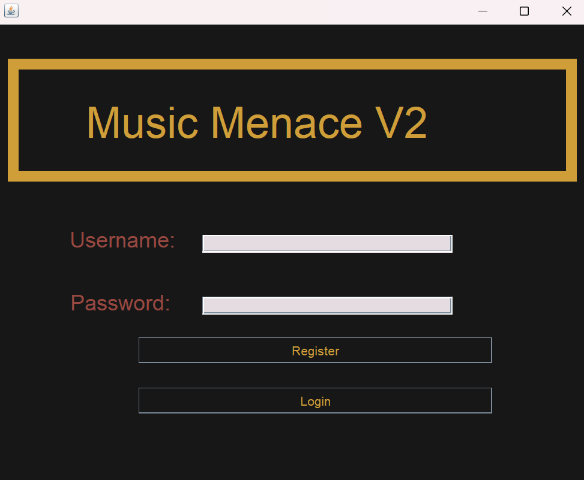
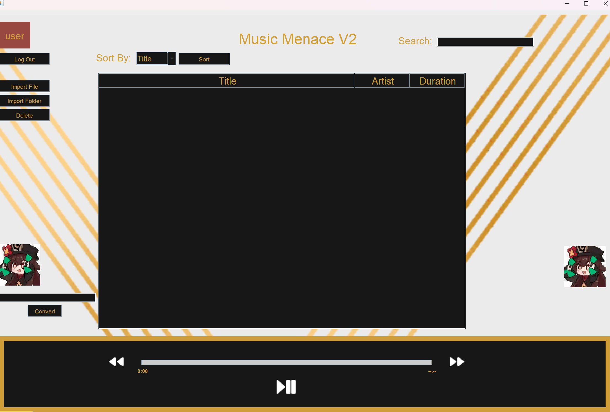
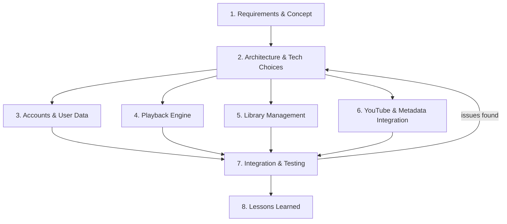

# Music Menace V2 — A Desktop Music Player

A Java music player with accounts, local file import, YouTube-to-audio conversion, and the
usual playback controls. The interface is Swing, audio plays through JavaFX, and two small
Python scripts handle YouTube downloads and reading track metadata.





---

## Disclaimer

This is for personal use only. Respect copyright — only download or import audio you have the
right to use.

---

## Project Overview

| Area | Details |
|---|---|
| UI | Java Swing (login window + player window) |
| Audio playback | JavaFX MediaPlayer |
| Accounts | Register and log in, stored in `data/users.json` |
| Library | Import a single file or a whole folder, kept per user |
| Sorting | Title (quicksort), Artist (bubble sort), Duration (quicksort) |
| Search | Live, case-insensitive filtering |
| YouTube | Paste a URL and convert it to WAV using yt-dlp + ffmpeg |
| Metadata | Title, artist, and duration read with tinytag |

---

## System Architecture

```
+------------------------------ Java application (Swing) ------------------------------+
|                                                                                     |
|  login.java  -------------------------->  musicMenaceV2.java (main player)          |
|    register / login                         play, seek, sort, search, delete        |
|    |                                        |                                       |
|    v                                        v                                       |
|  User.java                             Music.java, quickSort.java, bubbleSort.java  |
|  data/users.json                       JavaFX MediaPlayer (actual audio playback)   |
|                                                                                     |
|  JSON handoff files written and read through Python subprocesses:                   |
|    convertYoutubeWav/javaInp.json   readMetadata/javaInput.json                     |
|    convertPath.json                 pyOut.json                                      |
+--------------------------------------------+----------------------------------------+
                                             |
              +------------------------------+------------------------------+
              |                                                             |
              v                                                             v
  convertYoutubeWav/main.py                                      readMetadata/main.py
  yt-dlp + ffmpeg  ->  WAV file                                   tinytag + chardet  ->  metadata
              |                                                             |
              +------------------------------+------------------------------+
                                             v
                                data/[username]/music/
                                (imported audio files)
```

The Java app talks to the two Python scripts by writing small JSON files, running the script as
a subprocess, and reading the JSON result back. That keeps the heavy dependencies (yt-dlp, ffmpeg,
tinytag) out of the Java build and lets each piece do one job.

---

## Design Requirements

| ID | Requirement |
|---|---|
| R1 | Register and log in with a per-user music library |
| R2 | Import audio files one at a time or by folder |
| R3 | Play, pause, skip forward and back 15 seconds, and auto-advance to the next track |
| R4 | Sort the library by title, artist, or duration |
| R5 | Search the library live with case-insensitive matching |
| R6 | Convert a YouTube link into an audio file and add it to the library |
| R7 | Show title, artist, and duration for every track |
| R8 | Delete tracks from the library |

---

## Systems Design Process

The app came together in stages, with the pieces tested as they were wired up and problems
folded back into earlier stages.


```mermaid
flowchart TD
    A[1. Requirements & Concept] --> B[2. Architecture & Tech Choices]
    B --> C[3. Accounts & User Data]
    B --> D[4. Playback Engine]
    B --> E[5. Library Management]
    B --> F[6. YouTube & Metadata Integration]
    C --> G[7. Integration & Testing]
    D --> G
    E --> G
    F --> G
    G -->|issues found| B
    G --> H[8. Lessons Learned]
```

### Phase 1 — Requirements & Concept

Started by deciding what the app actually needed to do: accounts, a library, playback controls,
sorting, search, and YouTube conversion. That list became the requirements table above.

### Phase 2 — Architecture & Tech Choices

Settled on Swing for the UI and JavaFX's `MediaPlayer` for audio, since JavaFX handles media
playback far more cleanly than anything in plain Swing. YouTube download and metadata reading
went into Python sidecars, because `yt-dlp` and `tinytag` already exist and are far easier to use
from Python than reimplementing them in Java.

### Phase 3 — Accounts & User Data

Built the login and registration flow in `login.java`. Users are stored as JSON in
`data/users.json`, and each account gets its own `data/[username]/music/` folder.

- `login.java` — register, log in, validate credentials
- `User.java` — username and password model
- `data/users.json` — account store

### Phase 4 — Playback Engine

Wired up JavaFX `MediaPlayer` for play, pause, resume, and seeking. A Swing `Timer` drives the
progress bar, and the player auto-advances to the next track when a song ends.

- `musicMenaceV2.java` — playback logic and the player window
- `Music.java` — track model (title, artist, duration, path)

### Phase 5 — Library Management

Added import (file and folder), sorting, search, and delete. Sorting uses quicksort for title and
duration, and bubble sort for artist — bubble sort is stable, so it keeps the original order when
two artists match.

- `quickSort.java` — title and duration sorting
- `bubbleSort.java` — artist sorting
- `musicMenaceV2.java` — import, search filter, delete

### Phase 6 — YouTube & Metadata Integration

The Java app shells out to two Python scripts and passes data through JSON files.

- `convertYoutubeWav/main.py` — downloads a YouTube video and extracts WAV audio (yt-dlp + ffmpeg)
- `readMetadata/main.py` — reads title, artist, and duration from an audio file (tinytag + chardet)

### Phase 7 — Integration & Testing

Flashed out the whole flow: register, import files, play, seek, sort, search, convert a YouTube
link, and delete. See Known Issues for what still needs attention.

### Phase 8 — Lessons Learned

Two things stand out from testing: the YouTube flow doesn't always drop the converted file into
the library on its own, and account passwords are stored in plaintext. Both are documented below.

---

## How to Use

### 1. Install the dependencies

- Java (JDK) 20+
- Python 3
- Java libraries: JavaFX 21, json-simple 1.1.1
- Python packages: `yt-dlp`, `tinytag`, `chardet`, `ffmpeg-python`
- Command-line tools: `ffmpeg` and `ffprobe` (make sure ffmpeg is on your system PATH)

### 2. Run the login program

Run `login.java` and register with a username and password, or log in if you already have an
account.

- Passwords must be at least 6 characters.

### 3. Import audio


- Click **Import File** to add a single track, or **Import Folder** to add a folder of audio files.
- To convert a YouTube video, paste the link into the box on the bottom left and click **Convert**.

### 4. Where files live

Imported files are copied into `./data/[username]/music/`.

---

## Known Issues

- **YouTube conversion doesn't always import automatically.** After converting a link, the file may
  not appear in your library on its own — if it doesn't, import it by hand. The converted WAV is
  written to the app's root folder.
- **Passwords are stored in plaintext.** Accounts in `data/users.json` are not hashed. That's fine
  for a personal project, but not something to use in a real multi-user deployment.

---

## Repository Structure

| Path | Purpose |
|---|---|
| `src/login.java` | Login and registration window (entry point) |
| `src/musicMenaceV2.java` | Main player window and playback logic |
| `src/Music.java`, `src/User.java` | Track and user models |
| `src/quickSort.java`, `src/bubbleSort.java` | Sorting algorithms |
| `src/imgs/` | UI icons and images |
| `src/*.form` | NetBeans GUI form definitions |
| `convertYoutubeWav/main.py` | YouTube-to-WAV Python script |
| `readMetadata/main.py` | Audio metadata Python script |
| `data/users.json` | Account store |
| `data/[username]/music/` | Per-user music folders |
| `lib/` | Bundled JARs (jaudiotagger) |
| `build.xml`, `nbproject/` | NetBeans build configuration |
